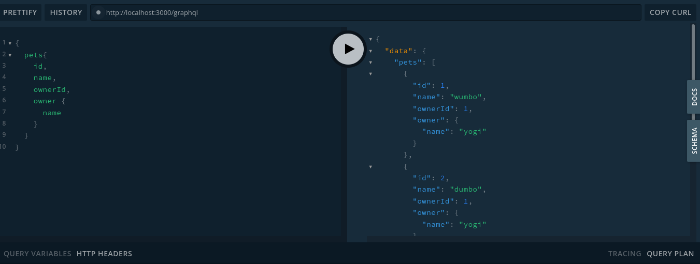
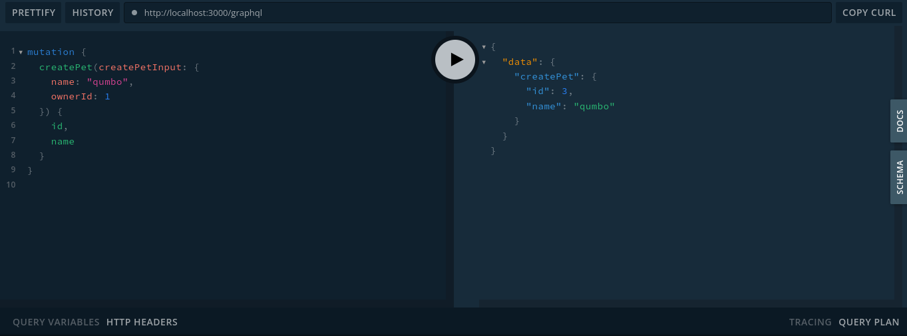

<p align="center">
  <a href="http://nestjs.com/" target="blank"></a>
</p>

[circleci-image]: https://img.shields.io/circleci/build/github/nestjs/nest/master?token=abc123def456
[circleci-url]: https://circleci.com/gh/nestjs/nest

  <p align="center">A progressive <a href="http://nodejs.org" target="_blank">Node.js</a> framework for building efficient and scalable server-side applications.</p>
    <p align="center">
<a href="https://www.npmjs.com/~nestjscore" target="_blank"></a>
<a href="https://www.npmjs.com/~nestjscore" target="_blank"></a>
<a href="https://www.npmjs.com/~nestjscore" target="_blank"></a>
<a href="https://circleci.com/gh/nestjs/nest" target="_blank"></a>
<a href="https://coveralls.io/github/nestjs/nest?branch=master" target="_blank"></a>
<a href="https://discord.gg/G7Qnnhy" target="_blank"></a>
<a href="https://opencollective.com/nest#backer" target="_blank"></a>
<a href="https://opencollective.com/nest#sponsor" target="_blank"></a>
  <a href="https://paypal.me/kamilmysliwiec" target="_blank"></a>
    <a href="https://opencollective.com/nest#sponsor"  target="_blank"></a>
  <a href="https://twitter.com/nestframework" target="_blank"></a>
</p>
  <!--[](https://opencollective.com/nest#backer)
  [](https://opencollective.com/nest#sponsor)-->

## Description

[Nest](https://github.com/nestjs/nest) framework TypeScript starter repository.

## Installation

```bash
$ npm install
```

## Running the app

```bash
# development
$ npm run start

# watch mode
$ npm run start:dev

# production mode
$ npm run start:prod
```

## Test

```bash
# unit tests
$ npm run test

# e2e tests
$ npm run test:e2e

# test coverage
$ npm run test:cov
```

## Support

Nest is an MIT-licensed open source project. It can grow thanks to the sponsors and support by the amazing backers. If you'd like to join them, please [read more here](https://docs.nestjs.com/support).

## Stay in touch

- Author - [Kamil Myśliwiec](https://kamilmysliwiec.com)
- Website - [https://nestjs.com](https://nestjs.com/)
- Twitter - [@nestframework](https://twitter.com/nestframework)

## License

Nest is [MIT licensed](LICENSE).


## Notes
Catatan proses belajar graphql dengan menggunakan nestjs(versi 7), repository ini digubuat dengan *code first*, yaitu schema graphql dibuat dengan menulis baris kode terlebih dahulu setelah itu akan digenerate oleh nest.

package graphql yang diperlukan

```sh
npm i @nestjs/graphql graphql-tools graphql apollo-server-express
```

konfigurasi graphql pada app.module.ts pada bagian imports
```typescript
  GraphQLModule.forRoot({
    autoSchemaFile: join(process.cwd(),'src/schema.gql'),
    driver: ApolloDriver
  })
```

graphql merupakan typed language yang kuat, mendefisinikan setiap tipe data yang digunakan pada graphql. Tipe data membantu mendefinisikan schema graphql.

```typescript
import { Field, Int, ObjectType } from "@nestjs/graphql";
import { Owner } from "src/owners/entities/owner.entity";
import { Column, Entity, ManyToOne, PrimaryGeneratedColumn } from "typeorm";

@Entity()
@ObjectType()
export class Pet {
    @PrimaryGeneratedColumn()
    @Field(type => Int)
    id: number;

    @Column()
    @Field()
    name: string;

    @Column({nullable:true})
    @Field({nullable:true})
    type?: string;

    @Column()
    @Field(type => Int)
    ownerId: number;

    @ManyToOne(() => Owner, owner => owner.pets)
    @Field(type => Owner)
    owner: Owner
}
```
baris kode diatas merupakan cara mendefinisikan tipe serta membangun skema database pada typeorm.

package integrasi dengan database bisa disesuaikan, bisa dengan typeorm, prisma dan lain lain.

```sh
npm install --save @nestjs/typeorm typeorm *(mysql2, sqlite3, postgres)
```
* bisa disesuaikan dengan database yang digunakan


## resolver
resolver merupakan koleksi dari fungsi yang akan digenerate berupa respon dari query graphql.
Pada nestjs resolver dibentuk dari class dengan decorator @Resolver() dari package @nestjs/graphql.

```typescript
import { Resolver } from '@nestjs/graphql';

@Resolver(of => Pet)
export class PetsResolver {
    // isi dari class pet resolver
}
```
## query 
query merupakan perintah dari graphql yang digunakan untuk membaca atau fetch data.

```typescript
import { Args, Int, Mutation, Parent, Query, ResolveField, Resolver } from '@nestjs/graphql';

@Resolver(of => Pet)
export class PetsResolver {
    constructor(private petsService: PetsService){}

    @Query(returns => Pet)
    getPet(@Args('id',{ type: () => Int }) id: number): Promise<Pet> {
        return this.petsService.findOne(id)
    }

    @Query(returns => [Pet])
    pets(): Promise<Pet[]> {
        return this.petsService.findAll();
    }
}
```
tampilan pada graphql playground
  

## mutations
mutations merupakan aksi pada graphql untuk menulis dan mengirim data.

```typescript
import { Args, Int, Mutation, Parent, Query, ResolveField, Resolver } from '@nestjs/graphql';

@Resolver(of => Pet)
export class PetsResolver {
    constructor(private petsService: PetsService){}


    @Mutation(returns => Pet)
    createPet(@Args('createPetInput') createPetInput: CreatePetInput): Promise<Pet> {
        return this.petsService.createPet(createPetInput)
    }
}
```

tampilan mutations pada graphql playground
  